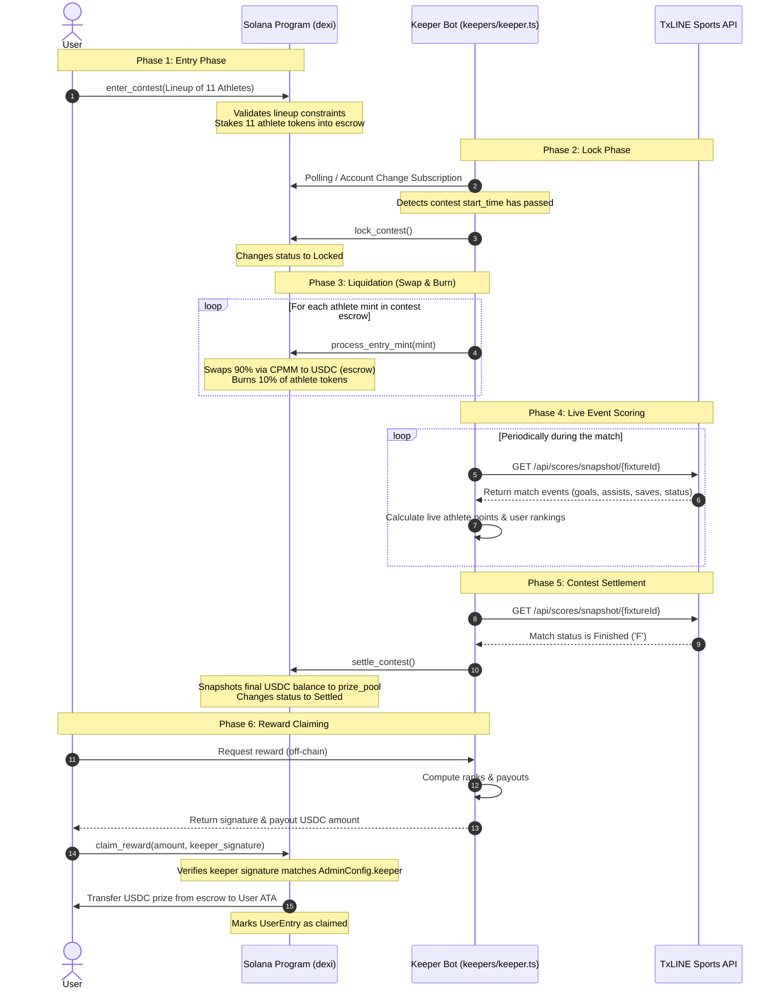
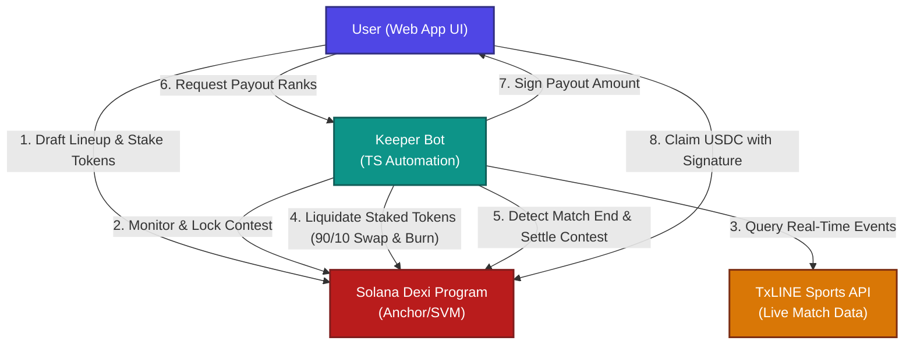

# TxLINE and Keeper Integration

This document details how the **TxLINE Sports API**, the **Keeper Bot**, the **Solana Dexi Program**, and the **User** interact throughout the lifecycle of a decentralized fantasy sports contest.

## 1. System Flow Sequence

The sequence below outlines the chronological steps of the fantasy contest lifecycle, from entry to live event resolution via **TxLINE** and final prize settlement.

---

## 2. Component Architecture Graph

This diagram shows the structural relationships and communication channels between the components.

### Relevant Code & Resources
- [keepers/keeper.ts](file:///home/utkarsh/Projects/dexi/keepers/keeper.ts) — The TypeScript keeper bot that orchestrates TxLINE data collection and transaction execution.
- [programs/dexi/src/instructions/lock_contest.rs](file:///home/utkarsh/Projects/dexi/programs/dexi/src/instructions/lock_contest.rs) — Anchor instruction to transition contests to `Locked`.
- [programs/dexi/src/instructions/market/process_entry_mint.rs](file:///home/utkarsh/Projects/dexi/programs/dexi/src/instructions/market/process_entry_mint.rs) — Handles swapping entry tokens to USDC and burning the rest.
- [programs/dexi/src/instructions/settle_contest.rs](file:///home/utkarsh/Projects/dexi/programs/dexi/src/instructions/settle_contest.rs) — Anchor instruction to settle the contest and freeze the prize pool.
- [programs/dexi/src/instructions/claim_reward.rs](file:///home/utkarsh/Projects/dexi/programs/dexi/src/instructions/claim_reward.rs) — Anchor instruction validating the keeper-co-signed claim request.
- [docs/scoring.md](file:///home/utkarsh/Projects/dexi/docs/scoring.md) — Documentation detailing how TxLINE event definitions correspond to fantasy points.
